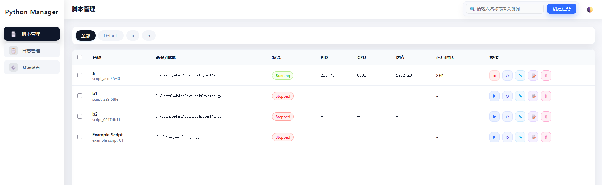

# Python Manager 🐍

[中文文档](readme_cn.md)

[](https://opensource.org/licenses/MIT)
[](https://www.python.org/downloads/)
[](https://flask.palletsprojects.com/)

A web-based tool for managing multiple Python scripts with real-time monitoring, logging, and control. Perfect for managing microservices, data pipelines, background jobs, or any collection of Python scripts.




## ✨ Features

- **🚀 Multi-Script Management**: Start, stop, and restart Python scripts from anywhere on your system
- **✏️ Script Editing**: Edit script configurations (arguments, interpreter, memory limits) directly from the UI
- **📊 Real-time Monitoring**: Track CPU and memory usage for each script
- **🔄 Auto-Restart**: Automatically restart scripts on failure with configurable retry limits
- **📝 Centralized Logging**: View logs for all scripts in one place
- **🌐 Web Interface**: Modern, responsive dashboard accessible from any browser
- **🔌 REST API**: Full API for programmatic control and automation
- **📁 Flexible Path Support**: Add scripts from ANY location on your system
- **⚡ WebSocket Support**: Real-time status updates without page refresh
- **🎯 Easy Deployment**: Multiple installation options for different use cases

## 🚀 Quick Start

### Option 1: Interactive Setup (Recommended)
```bash
git clone https://github.com/prismatex/python-manager.git
cd python-manager
python deploy/setup.py
```

### Option 2: Direct Run
```bash
# Clone the repository
git clone https://github.com/prismatex/python-manager.git
cd python-manager

# Install requirements
pip install -r requirements.txt

# (Optional) Download Socket.IO for offline use
python download_socketio.py

# Start the manager
python start_manager.py
```

Then open your browser to: **http://localhost:5000**

### 📦 Socket.IO Setup

Python Manager uses Socket.IO for real-time updates. By default, it loads from CDN (cdnjs.cloudflare.com). For offline use or better reliability:

```bash
python download_socketio.py
```

This downloads Socket.IO locally (MIT licensed, freely redistributable). The application automatically falls back to the local file if CDN is unavailable.

## 📋 Requirements

- Python 3.7 or higher
- pip (Python package manager)

Required packages (automatically installed):
- Flask
- Flask-SocketIO
- Flask-CORS
- psutil

## 🎯 Usage

### Adding and Editing Scripts

1. **Adding Scripts**:
   - Click the "➕ Add Script" button
   - Enter the full path to your Python script or browse for it
   - Configure display name, arguments, and auto-restart options
   - Click "Add Script"

2. **Managing Scripts**:
   - Click the "⚙ Manage Scripts" button to view all configured scripts
   - Click "Edit" to modify script configurations (arguments, interpreter path, memory limit, etc.)
   - Click "Remove" to delete a script from the manager

3. **Via Configuration File**:
   Edit `py_manager/config.json`:
   ```json
   {
     "scripts": [
       {
         "id": "my_script",
         "name": "My Awesome Script",
         "path": "C:/path/to/your/script.py",
         "args": ["--arg1", "value"],
         "auto_restart": true,
         "enabled": true,
         "max_memory_mb": 512,
         "log_file": "my_script.log"
       }
     ]
   }
   ```

### Managing Scripts

- **Start/Stop**: Click the respective buttons on each script card
- **View Logs**: Click "View Logs" to see real-time output
- **Bulk Actions**: Use "Start All" or "Stop All" for multiple scripts
- **Auto-restart**: Enable to automatically restart failed scripts

## 🛠️ API Usage

Python Manager provides a REST API for automation:

```python
import requests

# Base URL
base_url = "http://localhost:5000/api"

# Start a script
response = requests.post(f"{base_url}/scripts/my_script/start")

# Stop a script
response = requests.post(f"{base_url}/scripts/my_script/stop")

# Get all scripts status
response = requests.get(f"{base_url}/scripts/status")
print(response.json())

# Get logs
response = requests.get(f"{base_url}/scripts/my_script/logs?lines=50")
```

### API Endpoints

| Method | Endpoint | Description |
|--------|----------|-------------|
| GET | `/api/health` | Health check |
| GET | `/api/scripts` | List all scripts |
| GET | `/api/scripts/status` | Get status of all scripts |
| POST | `/api/scripts/{id}/start` | Start a script |
| POST | `/api/scripts/{id}/stop` | Stop a script |
| POST | `/api/scripts/{id}/restart` | Restart a script |
| GET | `/api/scripts/{id}/logs` | Get script logs |
| POST | `/api/scripts/add` | Add new script |
| DELETE | `/api/scripts/{id}/remove` | Remove script |

## 📦 Deployment Options

### For Development Projects
```bash
python deploy/setup.py
```
Follow the interactive prompts to set up Python Manager in your project.

### For Production
1. Clone to your server
2. Set up as a systemd service (Linux) or Windows Service
3. Configure authentication in `api_config.json`
4. Use a reverse proxy (nginx/Apache) for HTTPS

### Create Portable Package
```bash
python deploy/create_package.py
```
This creates a distributable ZIP file with everything needed.

## 🏗️ Project Structure

```
python-manager/
├── start_manager.py      # Main entry point
├── allin1.py            # All-in-one server
├── requirements.txt     # Python dependencies
├── py_manager/          # Core modules
│   ├── py_process.py    # Process management
│   ├── py_logger.py     # Logging system
│   ├── py_api.py        # REST API
│   ├── py_manager.html  # Web interface
│   └── ...
├── scripts/             # Example scripts
├── logs/               # Log files
└── deploy/             # Deployment tools
```

## 🤝 Contributing

Contributions are welcome! Please feel free to submit a Pull Request. For major changes, please open an issue first to discuss what you would like to change.

1. Fork the repository
2. Create your feature branch (`git checkout -b feature/AmazingFeature`)
3. Commit your changes (`git commit -m 'Add some AmazingFeature'`)
4. Push to the branch (`git push origin feature/AmazingFeature`)
5. Open a Pull Request

## 📝 License

This project is licensed under the MIT License - see the [LICENSE](LICENSE) file for details.

## 🙏 Acknowledgments

- Built with Flask and Flask-SocketIO
- Process monitoring powered by psutil
- UI inspired by modern dashboard designs

## 📧 Support

- Create an [Issue](https://github.com/prismatex/python-manager/issues) for bug reports or feature requests
- Check the [Wiki](https://github.com/prismatex/python-manager/wiki) for detailed documentation
- Join our [Discussions](https://github.com/prismatex/python-manager/discussions) for community support

## 🚧 Roadmap

- [ ] Docker support
- [ ] Script scheduling (cron-like functionality)
- [ ] Resource usage graphs
- [ ] Script dependencies management
- [ ] Email/webhook notifications
- [ ] Dark mode theme
- [ ] Multi-user support with authentication

---

Made with ❤️ by the Python community
